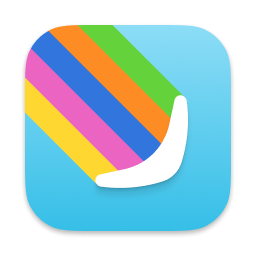

[**Sourcery Pro**](https://apps.apple.com/us/app/sourcery-pro/id1561780836?mt=12) is a Mac App that extends Xcode with the ability to create your own live templates that understand your code structure.

Do you hate writing same repetitive Swift patterns over and over again?

Now you don't need to, it's just a shortcut away.

 

Popular use-cases:

- Create mock implementation from a selected protocol
- Add Codable support to enums with associated values
- Kickstart your Composable Architecture boilerplate
- Generate property level tests
- Generate test specs from your classes
- Generate SwiftUI view from a struct
- Create Prisms and Lenses for your data

It comes **bundled with 14 starting templates** and features a powerful Template editor with code completion, inline documentation, and a built-in error checker/linter that makes writing your custom automation a breeze.

Built on top of my [Sourcery tool](https://github.com/krzysztofzablocki/Sourcery) that is used in over **40 000** Swift apps, including products like **Airbnb**, **Bumble**, and **The New York Times**.

It saved those apps millions of dollars in development time, and now you can save both your time and regain some of the sanity by stopping to write the same code over and over again, how much is your time worth?

This app is the culmination of 5 years of work and thousands of development hours, it's simply **the most powerful Xcode extension ever created**.

Even if you never heard of [Sourcery](https://github.com/krzysztofzablocki/Sourcery), you'll have no problem creating your own templates, and if you are a Sourcery user this tool not only makes creating your templates a completely different experience but also adds additional use-cases that are simply not possible with full CLI automation that I normally recommend with it.

You can share your templates with your friends and team by drag & dropping or right-clicking on the template in the list.
